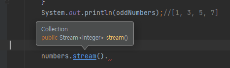
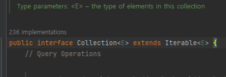
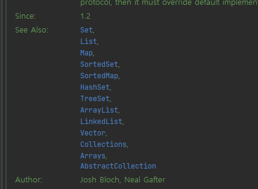

# Stream API

Java8의 스트림 API에 대해서 얘기해보겠습니다.

stream() 메소드는 Collection<E> 인터페이스의 정의되어 있는 메소드이므로 Collection 전체에서 사용할 수 있습니다.



Collection<E> 인터페이스는 Iterable<E>를 상속하고 있습니다. 





    default method helps in bring backward compatibility

default 메소드는 하위 호환성을 구현하는데 사용되고, default 메서드는 구현 클래스 내에서 사용할 수 있습니다.

```java
    default Stream<E> stream() {
        return StreamSupport.stream(spliterator(), false);
    }

```

