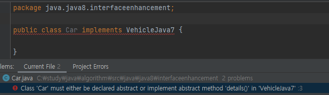
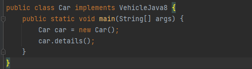
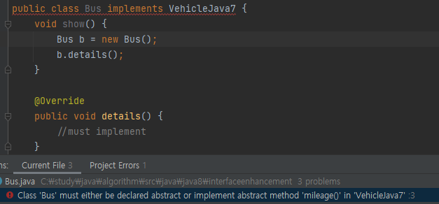

https://jinyoungchoi95.tistory.com/16

# Java8 - Interface Enhancement

# Introduction of deafult methods - Supports backward 

## Interface Java 7

1. 내부에서 선언할 수 있는 변수는 public static final 변수이다.
2. 내부에서 선언할 수 있는 메소드는 public abstract 메소드이다.
3. 구현 클래스는 public abstract 메소드의 구현을 강요받는다.

## Inteface Java 8

### Introduction of deafult method

Default 메소드가 Java8에서 도입되었고 Default 메소드는 클래스의 인스턴스를 통해서 호출한다.

```java
public interface VehicleJava7 {
    void details(); //public & abstract
    String color = "RED"; //public static final
}
```
```java
public interface VehicleJava8 {
    default void details() { // by default get available to all implementing classes
        System.out.println("I am Java 8 deafult method");
    }
}
```

Java8에서 Interface에 Default 메소드가 추가되었다. Default 메소드는 Interface에서 구현부를 작성할 수 있기 때문에, Abstract 메소드와 다르게 Interface를 Implement한 클래스에서 메소드 구현부를 작성하지 않아도 된다. 그리고 Interface를 Implement 클래스에서, 클래스를 통해서 Default 메소드를 자유롭게 호출 할 수 있다.





다시 말해 Java7에서는 Interface를 Implement할 때 모든 메소드(Abstract)를 구현해야하고 Java8에서는 Abstract 메소드는 구현하고 Default 메소드를 구현해야 하지 않아도 된다.

```java
public interface VehicleJava7 {
    void details(); //public & abstract
    String color = "RED"; //public static final

    void mileage();
}
```


이를 잘 생각하면 Java7에서는 이미 사용하고 있는 Interface에 새로운 메소드(Abstract)를 추가하면 Interface를 Implement하고 있는 클래스들 전체에서 메소드 구현을 강요당한다는 것이다. 각 클래스를 일일이 찾아서 메소드 구현부를 작성해야 한다. 하지만 Java8에서는 Default로 Interface에서 메소드를 구현하므로서 작성하므로서 이를 해결할 수 있다. 

Java8에서는 Default 메소드로 Interface에 Backward Compatibility를 제공한다. 

# Introduction of static method

1. Java8에서 Static 메소드가 도입되었다.
2. Staic은 Interface, Class에 포함된다. Class나 Interface를 통해서 호출할 수 있다.
3. 1개 이상의 Static 메소드를 호출할 수 있다.
4. Static 메소드는 Backward Compatibility 하위호환에 활용된다.
5. Static 메소드를 오버라이드 할 수 없다. Static 메소드는 인스턴스 메소드가 아니다.
6. Java8이상은 Main 메소드를 인터페이스에서 선언할 수 있다.

```java
public interface StaticMethodDemo {
    public static void show1() { //static method do not get available in implementing class
        System.out.println("I am a Java 8 Static Method");
    }

    public static void show2() { 
        System.out.println("I am a Java 8 Static Method 2");
    }

    public static void main(String[] args) {

    }
}
```
OOP를 기준으로 구현을 하면 Vehicle, VehicleImpl, VehicleMain 클래스를 구현할 수 있습니다. Vehicle 인터페이스를 보면 하나의 메소드만 존재하고 구현을 위해 VehicleImpl 클래스를 만들고 싶지 않습니다. 원하는 것은 구현하지 않고 이 인터페이스를 사용하는 것입니다. 
 
# Functional Interface

1. Functional Interface란 오직 하나의 추상 메소드를 가진 인터페이스를 말합니다.
2. Runnable Interface는 오직 run() 메소드만 가지고 있습니다. Functional Interface의 예입니다.
3. Comparable Interface는 오직 compareTo() 메소드만 가지고 있습니다. Functional Interface의 예입니다.
4. Functional Interface는 오직 하나의 추상 메소드를 가질 수 있고 그 외로 Default, Static 메소드들을 더 가질 수 있습니다. F
5. Functional Interface는 SAM(Single Abstract Method)으로도 불립니다.

Functional Interface의 구현으로 강요하기 위해서 Java8에서 @FunctionalInterface 애노테이션이 도입되었습니다.

```java
@FunctionalInterface
public interface InterfaceJava8 {

    public void show(); // 1 abstract method

    public default void details1()   {} //more than 1 default method

    public default void details2()   {} //more than 1 default method

    public static String enquire1() { //more than 1 static method
        return "Functional Interface";
    }

    public static String enquire2() { //more than 1 static method
        return "Functional Interface";
    }

//    public void details();
//    public String enquire();
}
```

# Lamda Expression

## OOP - Vehicle

람다표현식을 학습 하기 위해서 먼저 OOP에 대해서 얘기해야 합니다. 객체 지향 프로그래밍은 기본적으로 구현하는 것이 무엇이든간에 객체지향 프로그래밍 개념의 지침을 준수합니다. 클래스, 객체, 캡슐화, 상속, 다형성, 추상화 이 원칙을 준수해야 합니다. 객체 지향 프로그래밍 외에 또 구현 방법이 있습니다. 좀 더 명확하고 간결한 함수형 프로그래밍 입니다. 함수형 프로그래밍으로  객체지향형 프로그래밍보다 동일한 기능의 구현을 명확하고 간략하게 수행할 수 있습니다. 코드는 줄어들고 구현이 압축됩니다.

Vehicle Interface
```java
@FunctionalInterface
public interface Vehicle {
    void details();

    default void getMileage() {
        System.out.println("Showing mileage");
    }
}
```

Vehicle Interface Impl
```java
public class VehicleImpl implements Vehicle {
    @Override
    public void details() {
        System.out.println("Vehicle details after implementation");

    }
}
```

객체지향프로그래밍에서는 다음과 같이 기능을 구현합니다.
```java
public class VehicleMain {
    public static void main(String[] args) {
        System.out.println("main method");

        VehicleImpl vehicleImpl = new VehicleImpl();
        vehicleImpl.details();

        Vehicle vehicle = new VehicleImpl();
        vehicle.details();
    }
}
```

Vehicle구현체 또는 Vehicle인터페이스를 통해서 기능을 호출할 수 있습니다.

## Functional - Vehicle

함수형 프로그래밍에서의 구현을 살펴보도록 하겠습니다. 함수형 프로그래밍에서는 클래스에는 관심이 없고 함수에서의 관심은 구현과 인터페이스의 사용여부입니다. Vehicle의 details() 메소드는 void 리턴 타입을 갖고 매개변수를 사용하지 않는 메소드입니다.

details()을 람다식을 구현하기 위해서는 다음 코드부터 시작하면됩니다. (이 코드는 컴파일 오류가 발생하지만 이해하기 편합니다.) 

```java
Vehicle vehicle = new Vehicle() {
    @Override
    public void details() {
        System.out.println("Vehicle details after implementation");
    }
};
vehicle.details();
```

여기서 다음과 같이 인터페이스 정보와 메소드 명을 생략할 수 있습니다. ()는 매개변수 영역, {}는 구현부를 의미합니다.

```java
Vehicle vehicle = () - > {System.out.println("Vehicle details after implementation");};
vehicle.details();
```

구현부가 단일코드로 구성되어있으면 다음과 같이 작성해도 무방합니다. 

```java
Vehicle vehicle = () - > System.out.println("Vehicle details after implementation");
vehicle.details();
```

## Functional - MultiplyInterface

일반 메소드를 호출하는 코드에서 람다표현식으로 바꾸는 과정을 이렇게 정리할 수 있습니다.

1. Remove modifier
2. Remove return type
3. Remove method name
4. Add -> (arrow) sign
5. if code is one row, Remove {}

```java
@FunctionalInterface
public interface MultiplyInterface {
    public void multiply();
}
```

```java
    MultiplyInterface multiplyInterface = public void multiply() {
                                            System.out.println("I am a lamda function");
                                          };
    multiplyInterface.multiply();
```

```java
  MultiplyInterface multiplyInterface = () -> System.out.println("I m a lamda function");
        multiplyInterface.multiply();
```        

## Functional - Calculator

Calculator인터페이스를 정의하겠습니다. 

```java
@FunctionalInterface
public interface Calculator {
    Integer add(Integer num1, Integer num2);
}
```
Calculator인터페이스의 기능을 다음과 같이 구현할 수 있습니다.  
```java
Calculator calculator = new Calculator() {
    @Override
    public Integer add(Integer a, Integer b) {
        return a+b;
    }
};
Integer result = calculator.add(5, 7);
```

람다표현식으로 표현해봅니다.

```java
Calculator calculator = (Integer a, Integer b) -> { return a+b; }
Integer result = calculator.add(5, 7);
```

단일코드인 경우 다음과 같이 표현해도 무방합니다. 단일 값을 반환하는 경우 return도 함께 제거해주어야 합니다.

```java
Calculator calculator = (Integer a, Integer b) -> a+b;
Integer result = calculator.add(5, 7);
```

다음과 같이 매개변수가 1개인 경우 좀 더 생략할 수 있는 방법에 대해서 알아보도록 하겠습니다.

```java
@FunctionalInterface
public interface Calculator2 {
    Integer add(Integer num1);
}
```

매개 변수 1개인 경우 람다표현식에서 매개변수 부분을 다음과 같이 축약할 수 있습니다.  

```java
Calculator2 calculator2 = a -> a + a;
System.out.println(calculator2.add(2));
```

# Runnable

Runnable Interface도 FunctionalInterface의 한 종류입니다. 

```java
@FunctionalInterface
public interface Runnable {
    /**
     * When an object implementing interface <code>Runnable</code> is used
     * to create a thread, starting the thread causes the object's
     * <code>run</code> method to be called in that separately executing
     * thread.
     * <p>
     * The general contract of the method <code>run</code> is that it may
     * take any action whatsoever.
     *
     * @see     java.lang.Thread#run()
     */
    public abstract void run();
}
```

다음과 같이 Runnable 인터페이스를 구현합니다.
```java
public class CodeToRunAsSeperate implements Runnable {

    @Override
    public void run() {
        for(Integer count=0; count<=5; count++) {
            System.out.println("Child thread counter value is : " + count);
        }
    }
}
```

```text
Main thread counter value is : 0
Child thread counter value is : 0
Main thread counter value is : 1
Child thread counter value is : 1
Main thread counter value is : 2
Main thread counter value is : 3
Child thread counter value is : 2
Child thread counter value is : 3
Main thread counter value is : 4
Child thread counter value is : 4
Main thread counter value is : 5
Child thread counter value is : 5
``` 

결과를 예상 할 수는 없지만 Main Thread와 Thread1이 독립적으로 동작한다는 것을 확인할 수 있습니다.

람다 표현식으로 다음과 같이 Runnable 인터페이스를 손쉽게 구현할 수 있습니다.

```java
        Runnable runnable = () -> {
            for (Integer count = 0; count <= 5; count++) {
                System.out.println("Child thread counter value is : " + count);
            }
        };
        Thread thread1 = new Thread(runnable);
        thread1.start();
```

# Predicated

Pridicate 인터페이스
```java
@FunctionalInterface
public interface Predicate<T> {
    public boolean test(T t);
}
```

Predicate인터페이스를 implements 해서 사용하는 경우를 간단하게 살펴보겠습니다.
test메소드를 구현이 강요됩니다. 

```java
public class PredicateDemo implements Predicate<Integer> {
    @Override
    public boolean test(Integer age) {
        if(age > 18) return true;
        else return false;
    }
}
```
Predicate인터페이스 구현체를 사용합니다.
```java
public class PredicateDemoMain {
    public static void main(String[] args) {
        Predicate predicate = new PredicateDemo();
        boolean result = predicate.test(20);
        System.out.println(result);
    }
}
```
20이 18 보다 크기 때문에 true값을 얻을 수 있습니다. 
```
true
```

java.util.function package에 있는 Predicate인터페이스를 살펴보겠습니다.
```java
package java.util.function;

import java.util.Objects;

@FunctionalInterface
public interface Predicate<T> {
    boolean test(T t);

    default Predicate<T> and(Predicate<? super T> other) {
        Objects.requireNonNull(other);
        return (t) -> test(t) && other.test(t);
    }

    default Predicate<T> negate() {
        return (t) -> !test(t);
    }

    default Predicate<T> or(Predicate<? super T> other) {
        Objects.requireNonNull(other);
        return (t) -> test(t) || other.test(t);
    }

    static <T> Predicate<T> isEqual(Object targetRef) {
        return (null == targetRef)
                ? Objects::isNull
                : object -> targetRef.equals(object);
    }

    @SuppressWarnings("unchecked")
    static <T> Predicate<T> not(Predicate<? super T> target) {
        Objects.requireNonNull(target);
        return (Predicate<T>)target.negate();
    }
}
```

test 추상 메소드와 default 메소드 and, negate, or, static메소드 isEqual, not이 포함되어있습니다.

```java
public class PredicateDemoMainJava8 {
    public static void main(String[] args) {
//Predicate<Integer> predicate = (Integer age) -> {return age > 18;};
        Predicate<Integer> predicate = age -> age > 18;
        System.out.println(predicate.test(18));

        ArrayList<String> names = new ArrayList<>();

        //Predicate<ArrayList> predicate1 = (ArrayList list) -> {return list.isEmpty();};
        Predicate<ArrayList> predicate1 = list -> list.isEmpty();
        System.out.println(predicate1.test(names));

        names.add("John");
        System.out.println(predicate1.test(names));
    }
}
```

Java8의 Predicate 인터페이스를 활용한 람다식을 통해서 간단하게 위에서 작성된 코드를 대체할 수 있습니다.

```java
        Predicate<Integer> predicate = age -> age > 18;
        System.out.println(predicate.test(18));

        ArrayList<String> names = new ArrayList<>();
```

그리고 콜렉션의 경우에는 다음과 같이 적용할 수 있습니다.

```java
        Predicate<ArrayList> predicate1 = list -> list.isEmpty();
        System.out.println(predicate1.test(names));
```

홀수를 구분하는 코드를 샘플로 작성하겠습니다.

```java
public class PredicateExample {

    public static void main(String[] args) {
        Predicate<Integer> isOdd = num -> num % 2 != 0;
        System.out.println(isOdd.test(4));

        Integer[] numbers = {2, 6, 9, 4, 8, 22, 19};
        Predicate<Integer> oddEvenPredicated = num -> num % 2 != 0;

        for (Integer num : numbers) {
            if (oddEvenPredicated.test(num)) {
                System.out.println("Odd num " + num);
            }
        }
    }
}
```

짝수는 Prediate의 default method negate를 사용해서 쉽게 구현할 수 있습니다.

```java
    if (oddEvenPredicated.negate().test(num)) {
        System.out.println("Even num " + num);
    }
```

만약 10보다 큰 홀수를 찾는다고 하면 어떠헥 할 수 있을까?
다음 코드를 추가하면 된다. Predicate 인터페이스의 and() 메소드가 사용됩니다.
Predicate 인터페이스의 or() 메소드를 사용해서 쉽게 홀수거나 10보다 큰 수를 출력할 수도 있습니다.

```java
//find all the odd numbers which are greater than 10
Predicate<Integer> gt10Predicate = num -> num > 10;
for(Integer num : numbers) {
    if(gt10Predicate.and(oddEvenPredicated).test(num))  {
        System.out.println("Odd num > 10 " + num);
    }
}
```

Predicate의 인터페이스의 정적 메소드 isEqual를 살펴보면 다음과 같이 작성되어 있다.
이중 콜론 연산자가 사용되었는데 Objects::isNull은 object -> Objects.isNull(object)라고 생각하며 된다.

공식 문서의 설명에는 다음과 같이 적혀 있습니다.

Objects.equals(Object, Object)에 따라 두 인수가 동일한지 테스트하는 Predicate를 반환합니다.
매개변수: targetRef – 같음을 비교할 객체 참조(null일 수 있음)
보고:Objects.equals(Object, Object)에 따라 두 인수가 동일한지 테스트하는 술어

```java
   static <T> Predicate<T> isEqual(Object targetRef) {
        return (null == targetRef)
                ? Objects::isNull
                : object -> targetRef.equals(object);
    }
```

이를 활용해서 다음과 같은 코드를 작성할 수 있습니다.

```java
public class PredicateExampleIsEqual {
    public static void main(String[] args) {
        String name = "John";

        Predicate<String> nameEqualityPredicate = str -> abc.equals("John");
        
        System.out.println(nameEqualityPredicate.test(name));
    }
}
```

Predicate 인터페이스의 정적 변수 isEqual()을 사용해서 다음과 같이 표현할 수 있습니다.

```java
public class PredicateExampleIsEqual {
    public static void main(String[] args) {
        String name = "John";

        Predicate<String> nameEqualityPredicate2 = Predicate.isEqual("John");
        
        System.out.println(nameEqualityPredicate.test(name));
    }
}
```

```text
true
```

